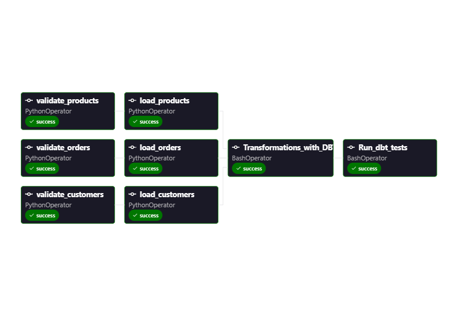
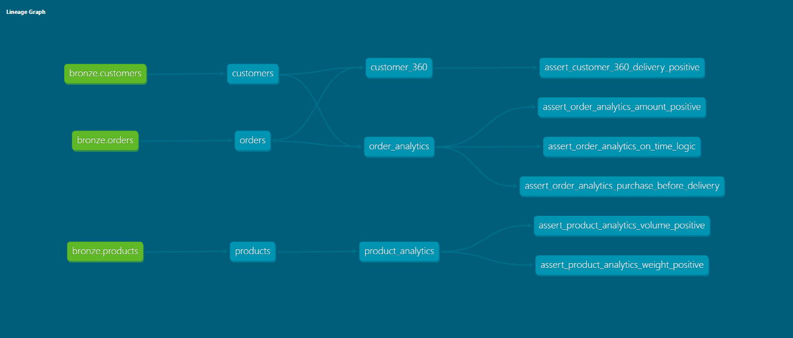
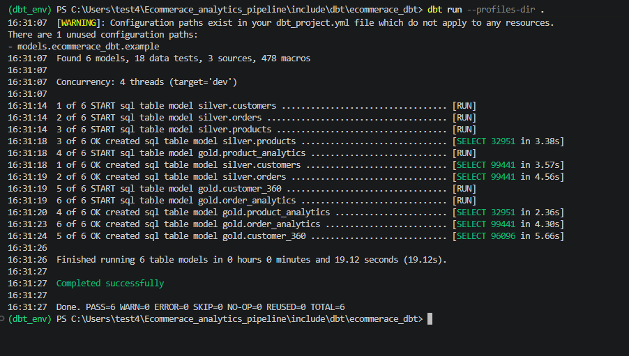
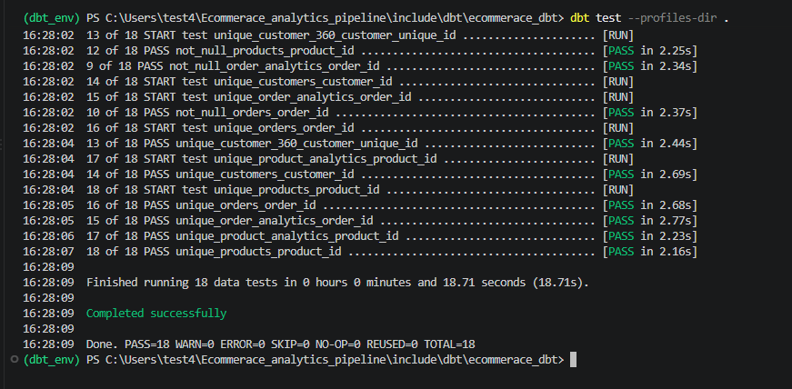

# 🛒 End-to-End E-Commerce Data Pipeline

An enterprise-grade, end-to-end data engineering pipeline built using **Apache Airflow**, **dbt (data build tool)**, **PostgreSQL**, and a **Medallion Architecture**. This project ingests, validates, transforms, and tests raw e-commerce data (Olist dataset) to deliver clean, analytics-ready tables for business intelligence.

---

## 🏗️ Architecture & Workflow

The pipeline follows modern data stack practices and is fully orchestrated via **Apache Airflow**:

1. **Ingestion & Validation Layer (Bronze):** 
   - Python custom operators (`PythonOperator`) validate the structure, headers, and row integrity of raw CSV source files (`customers.csv`, `orders.csv`, `products.csv`).
   - Validated data is securely loaded into the PostgreSQL database under the `bronze` schema using Airflow Postgres hooks.
2. **Transformation Layer (Silver & Gold via dbt):**
   - **Silver Layer:** Cleans, standardizes, and models raw tables into structured relational models.
   - **Gold Layer:** Aggregates business metrics, creating analytical datagores such as `customer_360`, `order_analytics`, and `product_analytics`.
3. **Data Quality Testing Gate:**
   - Automated tests (`dbt test`) run immediately after transformations to ensure data integrity, uniqueness, and validity before final consumption.

---

## 🛠️ Tech Stack

* **Orchestration:** Apache Airflow (Astro CLI / Docker)
* **Transformation & Modeling:** dbt (data build tool)
* **Data Warehouse / Storage:** PostgreSQL
* **Language:** Python, SQL
* **Environment Management:** Windows PowerShell, Python venv, Docker

---

## 📊 Airflow DAG & Pipeline Visuals
Here is a visual overview of the data architecture, Airflow pipeline execution, and dbt models:

### 1. Data Architecture


### 2. Airflow DAG Graph


### 3. dbt Models & Lineage (DBT Graph)


### 4. dbt Run & Test Results
* **DBT Run:**
  

* **DBT Test:**
  

---

## 🚀 Getting Started Locally

1. **Clone the repository:**
   ```bash
   git clone [https://github.com/mohamedAwad413/ecommerce-analytics-pipeline.git](https://github.com/mohamedAwad413/ecommerce-analytics-pipeline.git)
   cd ecommerce-analytics-pipeline

Initialize Astro / Airflow:
Ensure you have Docker and Astro CLI installed, then start the local environment:

Bash
astro dev start
Run dbt transformations manually (optional):

Bash
cd include/dbt/ecommerace_dbt
dbt run --profiles-dir .
dbt test --profiles-dir .
